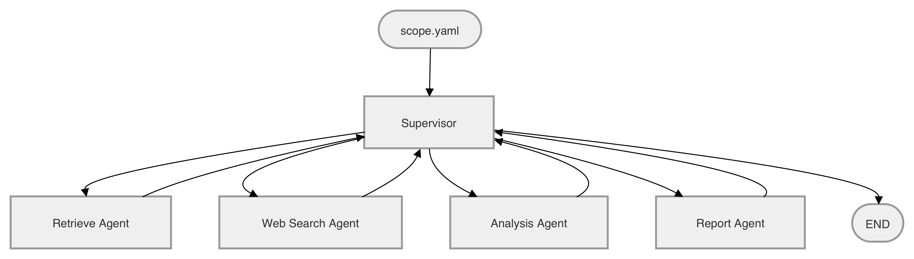

# R&D Strategy Agent

반도체 R&D 경쟁 정보를 자동 수집·분석하여 경쟁사 TRL 및 위협 수준을 평가하고 전략 보고서를 생성하는 멀티 에이전트 시스템.

## Overview
- **Objective** : 반도체 기술(HBM4, PIM, CXL) 분야의 경쟁사 R&D 동향을 자동 수집·분석하여 SK Hynix 관점의 전략 보고서 생성
- **Method** : LangGraph 기반 멀티 에이전트 파이프라인 — 웹 검색 → 증거 인덱싱 → TRL/위협 분석 → 보고서 작성 → PDF 출력
- **Tools** : Tavily, OpenAlex, ChromaDB, GPT-4o-mini, weasyprint

## Features
- 멀티 앵글 웹 검색 : 뉴스, IR 공시, 채용 신호, 학술 논문을 병렬 수집
- Hybrid Retrieval : ChromaDB dense + BM25 + RRF 융합으로 제품명 정확도와 의미 매칭 결합
- TRL 자동 추정 및 경쟁사 위협 매트릭스 생성 (채용·투자 신호 시 위협 등급 상향)
- 확증 편향 방지 전략 : 긍정·한계·비교·실패 4개 각도의 쿼리 템플릿으로 편향된 증거 수집 방지
- SC(Success Criteria) 기반 자동 품질 판정 및 최대 3회 재시도
- 전략 보고서 PDF 출력 (한글 + 도표 지원)

## Tech Stack

| Category  | Details                                        |
|-----------|------------------------------------------------|
| Framework | LangGraph, LangChain, Python                   |
| LLM       | GPT-4o-mini via OpenAI API                     |
| Retrieval | ChromaDB + BM25 (Hybrid RRF), Hit Rate@K / MRR |
| Embedding | BAAI/bge-m3                                    |
| Search    | Tavily API (병렬), OpenAlex API                 |
| Export    | weasyprint (PDF, 한글 Noto Sans KR)            |

## Agents

- **WebSearch Agent** : Tavily 다각도 병렬 검색 + OpenAlex 학술 논문 수집
- **Retrieve Agent** : ChromaDB dense + BM25 hybrid 인덱싱, hybrid_search 제공
- **Analysis Agent** : company × technology 쌍별 TRL 추정표 및 위협 매트릭스 생성
- **Report Agent** : 한국어 전략 보고서 초안 작성 + Reference 자동 생성 및 순차 번호 정리

## Architecture



## Directory Structure

```
├── src/rd_strategy_agent/
│   ├── main.py               # CLI entry point
│   ├── state.py              # 공유 상태 스키마 (TypedDict)
│   ├── supervisor.py         # LangGraph 그래프 + SC 기반 라우팅
│   ├── agents/
│   │   ├── scope.py          # scope.yaml 로드
│   │   ├── websearch.py      # Tavily 병렬 검색 + OpenAlex
│   │   ├── retrieve.py       # ChromaDB + BM25 hybrid
│   │   ├── analysis.py       # TRL 추정 + 위협 등급
│   │   └── report.py         # 보고서 작성 + Reference
│   └── utils/
│       └── sc_checker.py     # SC 자동 판정 (수치 기반)
├── eval/
│   ├── golden_queries.yaml   # 평가 질의 세트
│   └── evaluate.py           # Hit Rate@K / MRR 측정
├── tests/
│   └── test_sc_checker.py
├── scope.yaml                # 분석 범위 수동 설정 (실행 전 필수)
├── .env.example
└── pyproject.toml
```

## Quickstart

```bash
# 1. 의존성 설치
uv sync

# 2. 환경 변수 설정
cp .env.example .env
# .env에 OPENAI_API_KEY, TAVILY_API_KEY 입력
# OPENALEX_API_KEY는 선택 — 없어도 무료 사용 가능

# 3. scope.yaml 설정 (실행 전 수동 설정 필수)
#    technologies, competitors, keywords, n_evidence_min 항목을 채운다

# 4. 분석 실행 (보고서 → report.md)
uv run rd-agent
```

## Contributors

- 조성현 : 프로젝트 베이스라인 구축, Analysis Agent hybrid_search 적용, OpenAlex 통합
- 유건욱 : 상태 스키마 설계, SC 자동 판정 구현, 보고서 재시도 로직
- 손수민 : WebSearch 병렬화, 보고서 품질 개선, PDF 출력, Reference 중복 제거
- 최종민 : LLM 품질 검수 설계, Retrieval 평가 프레임워크 (Hit Rate@K / MRR)
