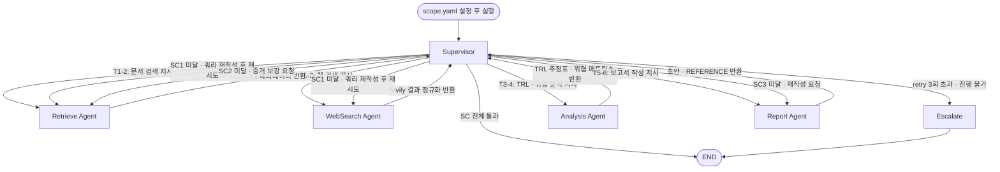

# Semiconductor R&D Intelligence Agent

> HBM4, PIM, CXL 등 최신 반도체 기술에 대한 경쟁사 동향을 자동 수집·분석하여 R&D 담당자가 즉시 활용 가능한 기술 전략 보고서를 생성하는 AI Agentic 시스템

## Overview

| | |
|---|---|
| **Objective** | HBM4 / PIM / CXL 기술 영역에서 경쟁사별 TRL(기술성숙도) 추정 및 위협 수준 비교 분석, 기술 전략 보고서 자동 생성 |
| **Method** | Supervisor 에이전트가 하위 에이전트(Retrieve / WebSearch / Analysis / Report)를 조율하는 멀티에이전트 워크플로우; SC(Success Criteria) 기반 자동 판정 및 재시도 |
| **Tools** | Tavily (웹 검색), FAISS (벡터 인덱스), BGE-m3 / multilingual-e5-large (임베딩), LangGraph (그래프 오케스트레이션) |

## Features

- **멀티소스 증거 수집**: 논문·학회·특허·공식 보도·IR 자료를 병렬로 수집; 익명 커뮤니티 출처 자동 제외
- **확증 편향 방지**: Tavily 다각도 쿼리 전략 — 현황·한계·경쟁·채용신호·반증 5가지 유형 병렬 실행; 단일 도메인 인용 비율 40% 초과 시 재검색 자동 트리거
- **TRL 기반 경쟁사 분석**: NASA TRL 1–9 척도 적용; TRL 4–6 추정 구간은 간접 지표(특허 출원 패턴·학회 발표 빈도·채용 키워드)를 근거로 명시적 한계 고지
- **SC 자동 판정**: 증거 건수·메타데이터 존재 여부·인용 매핑 등 계측 가능한 수치 기준으로 자동 Pass/Fail 판정; 재시도 3회 초과 시 에스컬레이션
- **구조화된 보고서 생성**: SUMMARY + 4절 목차 + REFERENCE (본문 인용 ↔ URL/DOI 1:1 매핑) 형식 자동 완성
- **프롬프트 품질 기준 내재화**: 근거성(증거 없는 창작 금지) · 완결성(경쟁사×기술 전체 조합 커버) · 일관성(TRL↔위협 등급 교차 검증) 3가지 기준을 Analysis·Report 프롬프트에 명시적으로 반영
- **LLM 출력 안정화**: JSON 파싱·필드 검증 실패 시 피드백 포함 자동 재요청(최대 2회); API 오류 시 그래프 중단 없이 `last_error` 기록 후 에스컬레이션; 환각 인용 자동 감지·표기

## Tech Stack

| Category | Details |
|---|---|
| Framework | LangGraph, LangChain, Python ≥ 3.11 |
| LLM | GPT-4o-mini / GPT-4o (`.env` LLM_MODEL로 변경 가능) |
| Web Search | Tavily API |
| Retrieval | FAISS — Hit Rate@K: **TBD**, MRR: **TBD** |
| Embedding | BGE-m3 / multilingual-e5-large (golden set 비교 후 확정) |
| Package Manager | uv |

## Agents

| Agent | 담당 Task | 역할 |
|---|---|---|
| **Supervisor** | 전체 | SC 자동 판정, 분기·재시도·에스컬레이션 조율, 최종 품질 검수 |
| **Retrieve** | T1, T2 | 로컬 문서 임베딩 인덱싱 및 하이브리드 검색 (Dense + BM25) |
| **WebSearch** | T1 (병렬) | Tavily 다각도·반증 쿼리 실행, 결과 정규화 및 메타데이터 저장 |
| **Analysis** | T3, T4 | TRL 추정표 및 위협 수준 매트릭스 초안 생성 |
| **Report** | T5, T6 | 보고서 목차 채움, REFERENCE 정합성 검증, SUMMARY 압축 |

## Architecture



## Directory Structure

```
agent_mini/
├── agents/
│   ├── supervisor.py      # SC 판정·분기·재시도 조율
│   ├── retrieve.py        # 임베딩 인덱싱 및 하이브리드 검색
│   ├── web_search.py      # Tavily 다각도 쿼리 실행
│   ├── analysis.py        # TRL 추정 및 위협 매트릭스 생성
│   └── report.py          # 보고서 초안 작성 및 REFERENCE 검증
├── data/                  # 로컬 PDF·문서 (git 제외)
├── eval/
│   ├── golden_queries.json  # Hit Rate@K / MRR 평가용 질의 세트
│   ├── relevance_labels.json
│   └── run_eval.py          # 평가 스크립트
├── outputs/               # 생성된 보고서 (git 제외)
├── scope.yaml             # 분석 범위 설정 (기술·경쟁사·키워드) — 실행 전 수동 설정
├── app.py                 # 실행 진입점 (scope.yaml 로드 포함)
├── pyproject.toml
├── .env.example           # API 키 템플릿
└── README.md
```

## Getting Started

```bash
# 1. 환경 설정
uv venv --python 3.11
source .venv/bin/activate   # Windows: .venv\Scripts\activate
uv sync

# 2. API 키 설정
cp .env.example .env
# .env에 TAVILY_API_KEY, ANTHROPIC_API_KEY (또는 OPENAI_API_KEY) 입력

# 3. 분석 범위 설정
# scope.yaml의 technologies, competitors, keywords 항목 수정

# 4. 보고서 생성 실행
python app.py
```

## Retrieval Evaluation

임베딩 모델 및 Retrieval 기법은 아래 기준으로 golden set 비교 평가 후 확정.

| 평가 지표 | 설명 |
|---|---|
| Hit Rate@K | 상위 K개 결과 내 정답 포함 비율 |
| MRR | Mean Reciprocal Rank — 정답의 평균 역순위 |

| 모델 / 기법 | Hit Rate@10 | MRR |
|---|---|---|
| BGE-m3 + Hybrid (Dense + BM25, RRF) | TBD | TBD |
| multilingual-e5-large + Dense | TBD | TBD |
| multilingual-e5-large + BM25 | TBD | TBD |

> 평가 세트: `eval/golden_queries.json` (질의 수·K값은 개발 완료 후 반영)

## Output Report Structure

생성 보고서는 아래 목차로 고정 출력된다.

```
SUMMARY                  핵심 내용 요약 (1/2페이지 이내)
1. 앞페이지               SK Hynix 보고서 포맷 (표지·목차)
2. 분석 배경              왜 지금 이 기술을 분석해야 하는가
   2.1 시장 동향 및 배경  텍스트 문단 + 그림/도표 (수요량 추이 등)
3. 분석 대상 기술 현황    SK Hynix 기술 수준·개발 방향
   3.1 HBM               영업이익·점유율·연구 수준
   3.2 PIM               영업이익·점유율·연구 수준
   3.3 CXL               영업이익·점유율·연구 수준
4. 경쟁사 동향 분석       기술 전략·최신 움직임
   4.x HBM / PIM / CXL   경쟁사 비교표 + 회사별 세부 내용 (optional)
5. 장기 관점 신기술 동향  차세대 메모리·신개념 아키텍처 (optional)
6. 전략적 시사점          R&D 우선순위 대응 방향 (단기/중기)
REFERENCE                본문 인용 ↔ URL/DOI/제목/접근일 1:1 매핑
```

> TRL 4–6 추정 구간은 공개 정보의 한계로 인해 간접 지표(특허 출원 패턴·학회 발표 빈도·채용 키워드) 기반 추정임을 보고서 본문에 명시한다.

## Contributors

| 이름 | 역할 |
|---|---|
| — | — |
